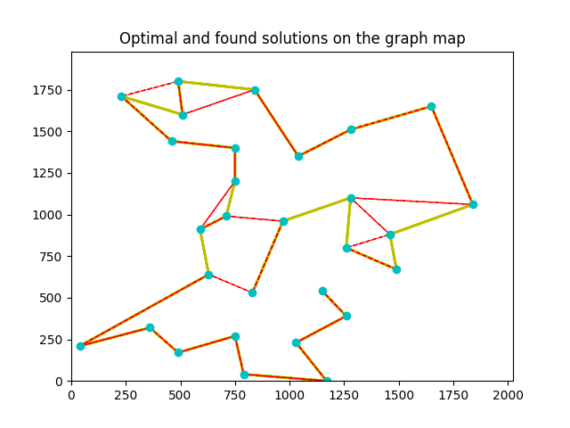
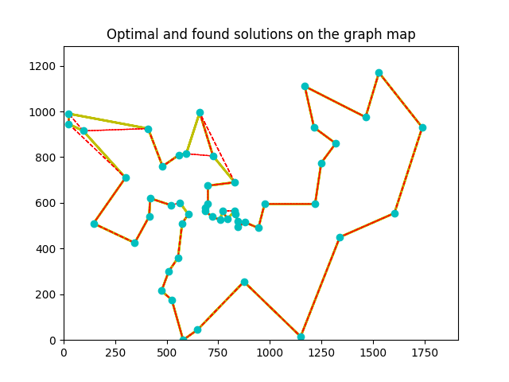

Implementation assignments for the course of Natural Computing for learning and Optimisation

### Assignment 1 - ACO solving TSP

Ant Colony foundation: https://github.com/ppoffice/ant-colony-tsp.git

Input data: [bays29.tsp](lab1_ACO/source_data/bays29.tsp) and [berlin52.tsp](lab1_ACO/source_data/berlin52.tsp)

Input data optimal path: [bays29.opt.tour](lab1_ACO/source_data/bays29.opt.tour) and [berlin52.opt.tour](lab1_ACO/source_data/berlin52.opt.tour)

**Results**: [results.tsv](lab1_ACO/results.tsv) and [temp_aco.tsv](lab1_ACO/temp_aco.tsv)

**Columns**: ants count, generations, alpha, beta, rho, qs, strategy, ending with pairs of found path length and optimal path length

Bays29 solution example, optimal in yellow and found in red



Berlin52 solution example, optimal in yellow and found in red



### Assignment 2 - PSO solving ACO solving TSP

Particle Swarm foundation: https://github.com/Lars-Moellerherm/PSO.git

**Results**: [results.tsv](lab2_PSO/results.tsv) and [temp_15_pso.tsv](lab2_PSO/temp_15_pso.tsv)

Added multiprocessing to the PSO particle initialization, such that one ACO is solved on one CPU. 
Requires pathos library to be installed.

### How to run

Setup the virtual environment, then run

```commandline
    pip install -r requirements.txt
```

After that check input data is in place and run the following commands

```commandline
    python lab1_ACO/lab1.py
```

```commandline
    python lab2_PSO/lab2.py
```